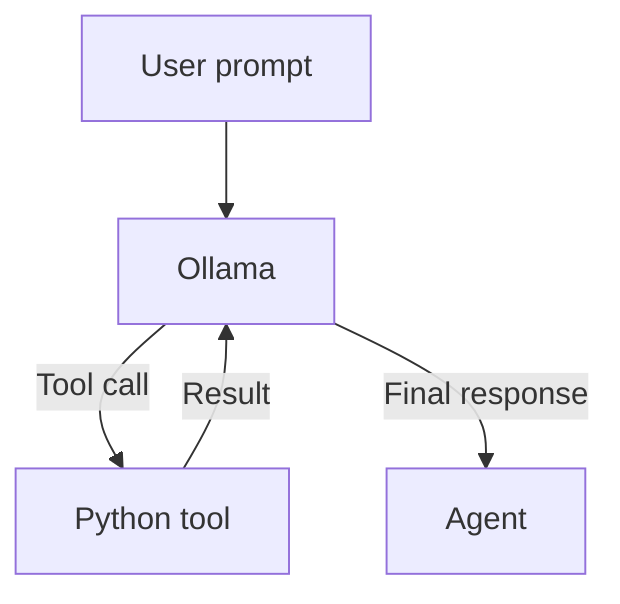
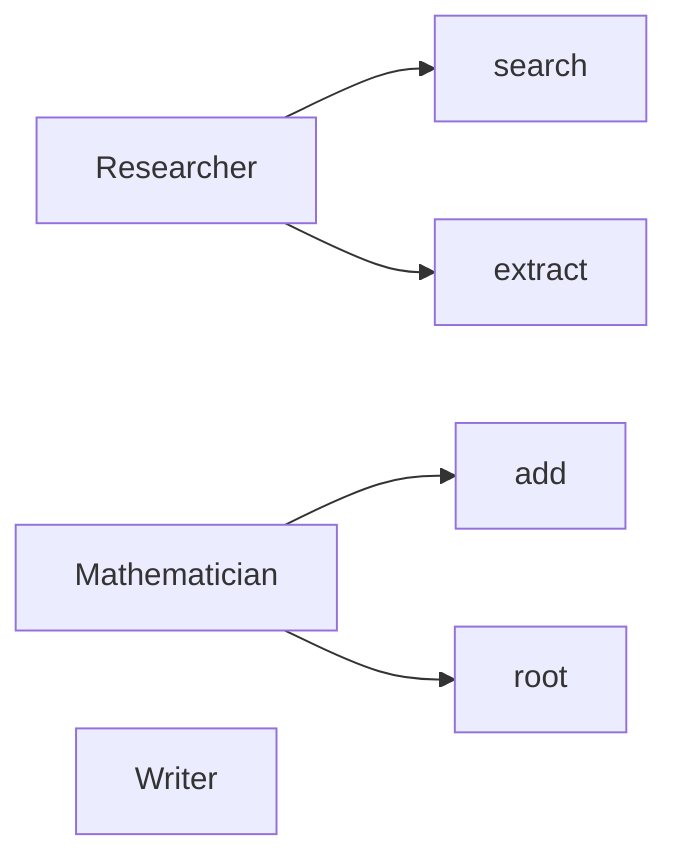
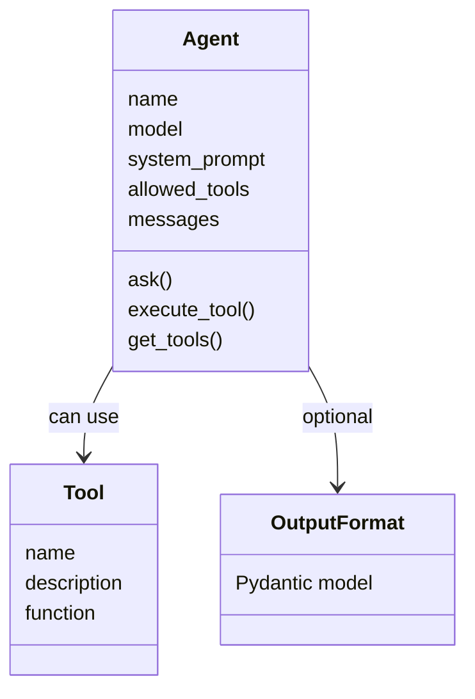
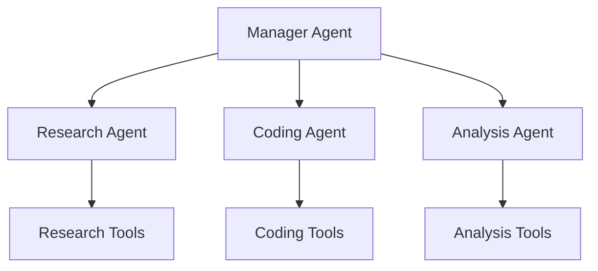

# Ollama Agent Library

A lightweight Python library for building **tool-using AI agents with Ollama**.

The library provides a simple interface for:

* Creating agents backed by Ollama
* Giving agents access to Python functions as tools
* Restricting which tools each agent can use
* Maintaining conversation history
* Validating structured outputs with Pydantic
* Running Ollama remotely over a local network

## Installation

```bash
pip install ollama pydantic
```

You will also need an Ollama server with a suitable model installed.

---

## Basic Usage

An agent is created with a name, model, system prompt and a list of tools it is allowed to use:

```python
from agent_library import Agent

ai = Agent(
    "Mathematician",
    "qwen3:8b",
    "You are a mathematician.",
    ["add", "root"]
)

result = ai.ask("Calculate the square root of 144.")
```

See [`example.py`](example.py) for a complete example.

---

## Tools

Python functions can be registered as tools using the `@tool` decorator:

```python
from agent_library import tool

@tool("add", "Adds two numbers.")
def add(a: float, b: float) -> float:
    return a + b
```

The function's type annotations are used to generate the tool's parameter schema for Ollama.

The agent can then be given access to it:

```python
Agent(
    "Mathematician",
    "qwen3:8b",
    "You are a mathematician.",
    ["add"]
)
```

### Tool calling

The agent automatically handles the tool-calling loop:



Tools are executed by Python; the model only decides when to call them and what arguments to provide.

---

## Tool Permissions

Each agent has an explicit list of allowed tools.

For example:

```python
Agent(
    "Researcher",
    "qwen3:8b",
    "You are a research agent.",
    ["search", "extract"]
)
```

If the model attempts to call a tool that isn't in this list, the library rejects the call.

This allows different agents to have different capabilities:



---

## Structured Output

Agents can optionally return validated Pydantic models.

```python
from agent_library import OutputFormat

class MathsOutput(OutputFormat):
    result: float
    rounding: str
    steps: list[str]
```

Then:

```python
result = ai.ask(
    "Calculate the square root of 144.",
    output_format=MathsOutput
)
```

The returned value is a validated `MathsOutput` instance.

If the model produces invalid output, the library automatically makes a second request using Ollama's structured-output format to correct it.

The agent can therefore use tools normally before producing its final structured response.

---

## Agent Architecture

An `Agent` contains:



Multiple agents can be combined to build larger systems:



---

## Remote Ollama

The library can connect to an Ollama server running on another machine.

Configure the host in `agent_library.py`:

```python
OLLAMA_HOST = "http://192.168.3.237:11434"
```

This allows the Python agent and Ollama to run on separate machines on the same network.

---

## Intended Use

This library is intended as a **small foundation for experimenting with AI agents**, particularly:

* Tool-using agents
* Multi-agent systems
* Research agents
* Coding agents
* Mathematical agents
* Local AI applications
* Agent-to-agent communication
* Structured AI workflows

It deliberately keeps the agent loop simple rather than hiding it behind a large framework.

---

## Project Structure

A typical project might look like:

```text
.
├── agent_library.py
├── example.py
└── README.md
```

`example.py` contains a complete working example of registering tools, creating an agent and using structured output.

---

## Limitations

The library is currently intentionally minimal.

Some current limitations include:

* Basic Python → JSON type conversion
* No built-in tool sandboxing
* Global tool registry
* Tool exceptions are not yet converted into model-readable errors
* Structured output correction requires an additional model request

These can be extended as the library develops.
